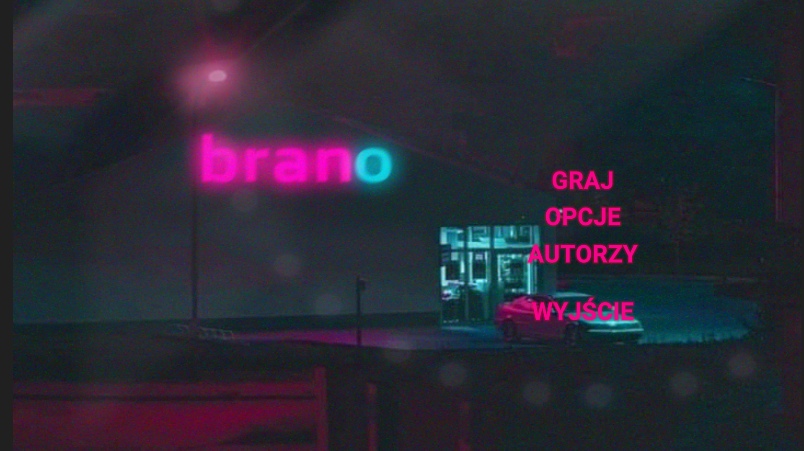
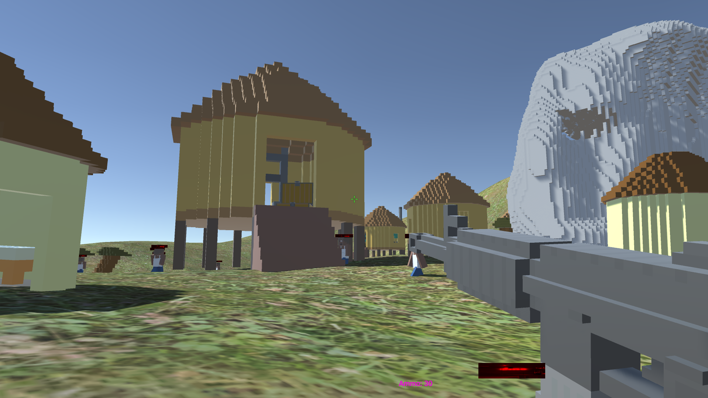

# Brano: Pact With The Devil

A first-person shooter built in Unity as a personal high school project, developed for learning purposes and fun.

**Status:** Early stage of development -- features and content are subject to change.

## Screenshots





## Overview

Brano: Pact With The Devil is a voxel-style FPS game featuring AI-driven enemies with NavMesh pathfinding, physics-based interactions, and a custom UI. The game focuses on combat mechanics, resource management, and navigation within the game environment.

## Features

- Fast-paced first-person shooter mechanics
- Enemy combat system (shootable AI)
- Multiple weapon types
- Health pack system for resource management
- AI enemy pathfinding (Unity NavMesh)
- Physics-based gameplay
- Custom UI with TextMeshPro
- Audio and music integration

## Technology

| Component   | Details                                     |
| ----------- | ------------------------------------------- |
| Engine      | Unity 2022.3.62f3                           |
| Language    | C#                                          |
| Platform    | Windows x64                                 |
| Key modules | NavMesh, TextMeshPro, Timeline, Physics, UI |

## Requirements

- **Unity 2022.3.62f3** or newer (LTS recommended)
- **Git** (for cloning)

## Getting Started

1. Clone this repository: `git clone https://github.com/Dedeusz04/BranoPactWithTheDevil.git`
2. Open the project in Unity 2022.3.

## Play the Game (Build)

If you don't have Unity installed, you can play the latest version of the game directly from the `test/` folder:
1. Navigate to the `test/` directory.
2. Run `Gra.exe`.

## Project Structure

```
Assets/              -- game assets, scripts, scenes, and models
Packages/            -- Unity package dependencies
ProjectSettings/     -- Unity project configuration
Screenshots/         -- in-game screenshots
```

## Credits

- **Programming and game design** -- sole author
- **3D models** -- external contributor
- **Music and sound** -- external contributor

## License

This project was created for educational purposes.
